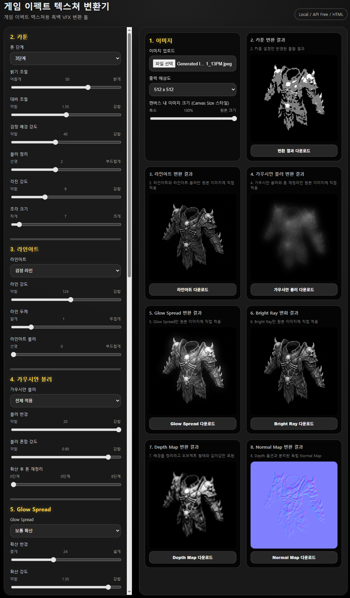

# FX_effects-texture-converter

FX 효과 텍스처 이미지를 변환하거나 정리하기 위한 웹 도구입니다.

## 주요 기능

- FX 텍스처 이미지 업로드
- 텍스처 변환
- 결과 이미지 미리보기
- 변환된 이미지 다운로드

## 사용 방법

1. 웹페이지에 접속합니다.
2. 변환할 이미지를 업로드합니다.
3. 원하는 옵션을 선택합니다.
4. 변환된 결과를 다운로드합니다.

## 화면 예시

## 파일 설명

| 파일명 | 설명 |
|---|---|
| `index.html` | 웹페이지의 메인 파일입니다. |
| `README.md` | 프로젝트 설명 문서입니다. |

## 배포 주소

GitHub Pages를 통해 아래 주소에서 실행할 수 있습니다.

https://kandol555.github.io/FX_effects-texture-converter/

네이버블로그
https://blog.naver.com/kandol55/224329889677
